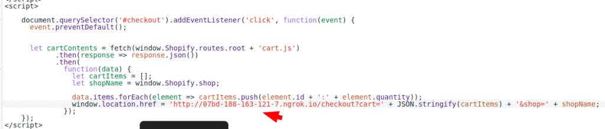
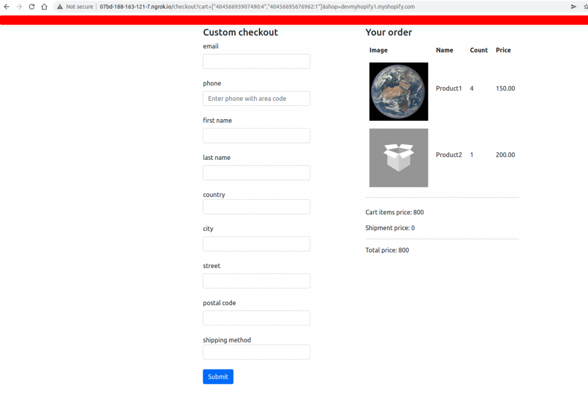

**Name**: Customization of Shopify Checkout Application  
**Platform**: CMS Shopify  
**Ver**. 1.0  
**Description**: application that allows to customize Shopify checkout pages.
It's experimental app that makes possible to create your own style of checkout without the Shopify Plus tariff plan. Our solution allow you to customize the checkout pages of a Shopify store despite the official restrictions in checkout customization.

The chekout customization application was developed taking into account that it will be used not in every Shopify store. It is still difficult to achieve full versatility, because each online store has its own functionality. The developed solution is rather a “skeleton” for further implementation and integration with the selected store.

1. It all starts with the fact that the user installs the application. A notation is entered into the database that the store is registered, and data about it is added to the database. To further configurations, you need to insert JS code that will collect user cart data. After the user clicks the checkout button, this JS code will start working and generate a feed for hosting with the checkout. This feed will contain the product ID and there quantity. Also, it is important to add to the feed the name of the store with which the custom checkout will process. Without this, the app will not be able to properly understand where to create orders.

2. However, the installation is not enough. As we mentioned earlier, each store has its own unique functionality. So just install the app and start selling – it will not work. You need to manually adjust the code to the Shopify theme, as we’ve show on the screenshot below.

3. After setting up the application, the Shopify store starts working with a custom checkout. When you click on the checkout button, you will be redirected to our custom solution. You can set up the interface but not through the admin panel of the site. You need to involve a front-end developer for this.

NOTICE! This solution is cheating Shopify, and the platform will not receive a transaction fee. The app we’ve built to customize the Shopify checkout page can be used only at your own risk.
Additional information you can read in our blog - https://web-systems.solutions/en/blog/customizing-shopify-checkout-pages/

WARNING! By downloading and installing this application, you accept the fact that the module is distributed free of charge on the model "AS IS". You do everything at your own risk. The authors of the addon are not responsible for errors, omissions or conflicts of the module with other applications or sanctions against your website.

For additional integration issues just mail us - info@web-systems.solutions
